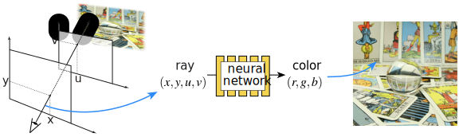

# Learning Neural Light Fields with Ray-Space Embedding
## [Website](https://neural-light-fields.github.io/) |  [Paper](https://arxiv.org/abs/2112.01523) | [Data](https://drive.google.com/drive/folders/1MnniS2uk5vIQ4XtzVSbD-CY7oEZQoL-2?usp=sharing) | [Results](https://drive.google.com/drive/folders/1PHIFKF-KFllbyQACRf4-CBolQOM5-Fvk?usp=sharing)

This repository contains a pytorch-lightning implementation for the paper [Learning Neural Light Fields with Ray-Space Embedding](https://arxiv.org/abs/2112.01523). The entirety of neural-light-fields is licensed under the MIT license. The design of this project was inspired by [nerf_pl](https://github.com/kwea123/nerf_pl).



## Table of contents
-----
  * [Installation](#Installation)
  * [Datasets](#Datasets)
  * [Training](#Training)
  * [Testing](#Testing)
  * [Results](#Results)
  * [Evaluation](#Evaluation)
  * [Citation](#Citation)
------


# Installation

To set up an environment using conda, with all of the appropriate Python dependencies, run

```bash
conda env create -f environment.yml
```

Next, to build the NSVF voxel octree intersection package, run

```bash
python setup.py build_ext --inplace
```

# Datasets

We have consolidated all of the datasets we make use of [here](https://drive.google.com/drive/folders/1MnniS2uk5vIQ4XtzVSbD-CY7oEZQoL-2?usp=sharing). Note that we have made **no modifications** to the original datasets, they are simply collected here for convenience.

In order to use one of the zipped datasets, unzip it and place it within the `data/` folder.

# Training

## Stanford Lightfield Training

To train a neural light field on the Stanford Light Field Dataset, run

```bash
python main.py experiment=stanford_lf experiment/dataset=stanford_<scene>
```

You can change the model / embedding network with

```bash
python main.py experiment=stanford_lf experiment/model=stanford_<affine/feature/no_embed>
```

## Shiny Dense Lightfield Training

To train a neural light field on the Shiny Dataset (CD or Lab scenes), run

```bash
python main.py experiment=shiny_lf_dense experiment.dataset.collection=<scene>
```

## LLFF Subdivided Lightfield Training

To train a *subdivided* neural light field on NeRF's Real Forward Facing Dataset, run

```bash
python main.py experiment=llff_subdivided experiment.dataset.collection=<scene>  experiment.model.subdivision.max_hits=<num_subdivisions>
```

## Shiny Subdivided Lightfield Training

To train a *subdivided* neural light field on the Shiny dataset, run

```bash
python main.py experiment=shiny_subdivided experiment.dataset.collection=<scene> experiment.model.subdivision.max_hits=<num_subdivisions>
```

# Testing
Testing is performed automatically during training with frequency dictated by `experiment.training.test_every`. Results are written by default to `logs/<experiment_name>/val_images/<epoch>`. You can also manually trigger testing by running

```bash
python main.py ... <model_settings> ... experiment.test_only=True
```

In this case, the test set predictions and ground truth will be written out to `<log_dir>/testset`

# Rendering
Rendering is performed automatically during training with frequency dictated by `experiment.training.render_every`. Individual video frames are written by default to `logs/<experiment_name>/val_videos/<epoch>`. You can also manually trigger rendering by running

```bash
python main.py ... <model_settings> ... experiment.render_only=True
```

In this case, the individual rendered frames will be written out to `<log_dir>/render`

# Results

We provide all of the predicted images that we use to compute our evaluation metrics [here](https://drive.google.com/drive/folders/1PHIFKF-KFllbyQACRf4-CBolQOM5-Fvk?usp=sharing).

# Evaluation

You will need to create a new conda environment to run the evaluation code, since it relies on a different version of CUDA / tensorflow

```bash
cd baselines/third_party/evaluation
conda env create -f environment.yml
```

For structured light field predicitons, where your directory containing image predictions from the model has **all** images, including predictions on training images (e.g. from our modified X-Fields codebase), run

```bash
python run_evaluation.py --mode lightfield --gt_dir <gt_dir> --pred_dir <pred_dir> --out_dir <out_dir> --metrics_file <out_metrics_file>
```

When you have only heldout images, and ground truth / predictions are in the same directory (e.g. our method and NeRF), run

```bash
python run_evaluation.py --mode same_dir --gt_dir <gt_dir> --out_dir <out_dir> --metrics_file <out_metrics_file>
```


# Citation

```
@inproceedings{attal2022learning,
  author    = {Benjamin Attal and Jia-Bin Huang and Michael Zollh{\"o}fer and Johannes Kopf and Changil Kim},
  title     = {Learning Neural Light Fields with Ray-Space Embedding Networks},
  booktitle = {Proceedings of the IEEE/CVF Conference on Computer Vision and Pattern Recognition (CVPR)},
  year      = {2022},
}
```
